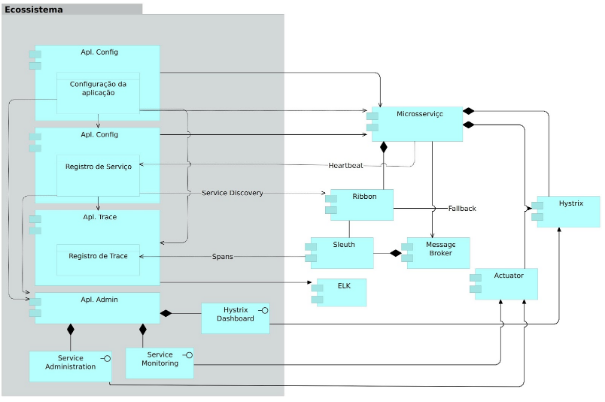

# Estudo de caso

O presente estudo de caso apresenta as etapas do processo de elaboração de um ecossistema para suportar aplicações voltadas para a arquitetura de microsserviços. Este trabalho impulsionou o estudo sobre os requisitos, padrões e princípios necessários para o desenvolvimento da solução.
Será apresentada a experiência do arquiteto de software no processo de construção desta solução, explicando os desafios, vantagens e riscos.
A motivação para a empresa, deste estudo, se deu, pela oportunidade de evoluir as arquiteturas das aplicações, trazer mais agilidade no desenvolvimento, velocidade de entrega e escalabilidade seletiva. Uma evolução de uma arquitetura monolítica para a de microsserviços, tem como objetivo, atingir os princípios de responsabilidade única e autonomia no serviço. Podemos ver isso exemplificado na figura x.

Monólito vs Microsserviços:

Fonte de Origem[https://martinfowler.com/tags/microservices.html]

Atualmente as aplicações monolíticas fazem separações entre camadas, porém não entre domínios de serviços.

Os desafios que existem, hoje, na empresa é modelar soluções que agrupem serviços por domínios distintos, desde as camadas de web e serviços rest até a base de dados. Construindo classificação e segregando domínio de negócio em microsserviços autônomos. Por exemplo, um portal deveria estar modelado e classificando os serviços em módulos distintos, desde serviços rest/web até base de dados distintas. Como está apresentado na figura x.

O desafio mais impactante, está na camada de dados, pois precisa ser modularizada, como as aplicações, em distintos domínios e segregado fisicamente em bancos diferentes . Isso pode ser melhor observado na Figura X. As bases legado da empresa teriam uma enorme custo para serem adequadas para uma solução plena de microsserviços. Porém para aplicação novas seria o ideal iniciar já com o novo paradigma.

Segue a lista de questões a serem satisfeitas pela arquitetura de microsserviços:

- Incapacidade de dimensionar os componentes individuais.
- Desempenho de componentes individuais.
- Implementabilidade de componentes individuais.
- Diminuir complexidade do código e manutenção.
- Dificuldade em testar com precisão um aplicativo.

## Descrição do problema

Podemos exemplificar o problema em um cenário comum de aplicações monolíticas, onde um portal web com separações claras entre camadas, segue as práticas habituais de ser implantado como um único arquivo binário.
Esta mesma aplicação tem dados armazenados em um banco de dados relacional tradicional. Quando as regras de negócio crescem, a complexidade do código-fonte e na base de dados também aumentam. Isso resulta em um aumento de transações proporcional a este crescimento. Se tornando cada vez mais difícil a manutenção e a possibilidade de escalar de forma seletiva. Ou seja, escalar para um serviço de um domínio específico.

## Oportunidades

Oportunidades observadas para a arquitetura alvo:

- Cada serviço é uma aplicação autocontida e manutenível;
- Definir que os serviços são independentes e implantáveis;
- Definir serviços elasticamente e seletivamente escaláveis;
- A arquitetura microsserviços permite que as equipes sejam autônomas;
- Maior confiabilidade das equipes adotarem novas tecnologias;
- Falhas isoladas fiquem no escopo de cada serviço;
- Promover uma arquitetura poliglota, independente de tecnologias;
- Permitir a coexistência de diferentes versões dos componentes do ecossistema;
- Ajudar a reduzir a dívida tecnológica;
- Permitir substituição com baixo impacto, dos componentes do ecossistema.

## Requisitos

Nos requisitos levantados a solução deverá englobar:

1. A capacidade de gerir e escalar os componentes de forma individual.
2. O monitoramento do desempenho de componentes de forma individual.
3. Uma arquitetura de API de serviços agrupados por domínio.
4. Padrões para rápida construção e disponibilização de novos serviços integrados.
5. A capacidade de gerir a externalização de forma centralizada da configuração dos serviços.
6. A capacidade de gerir registros e descobertas automáticas dos serviços, facilitando a integração e a chamada entre eles.
7. Um painel integrado central de administração e monitoramento online dos serviços
8. A capacidade de balanceamento automático e de integração com outros serviços externos
9. A capacidade de proteção contra falhas em cascata dos serviços e recuperação do mesmo.
10. A capacidade de gerir e fornece a rastreabilidade e uma visão de dependência entre os serviços.
11. A segurança com a proteção do acesso aos dados sensíveis de configurações dos serviços
12. A visualização do rastreamento distribuído de logs e latência da comunicação entre microsserviços.

## Solução

Através dos requisitos levantados, o arquiteto observou que alguns padrões e princípios citados anteriormente deveriam ser aplicados na solução proposta. Foi identificado que o padrão de interface separada e stub de serviço, por exemplo, coincide com os requisitos referentes à capacidade de disponibilizar serviços de API e gerir componentes de forma individual.

Seguindo este mesmo raciocínio, os princípios de segregação de interface, responsabilidade única e princípio de separação de preocupações, resolvem também os requisitos responsáveis por capacidade de proteção contra falhas em cascata dos serviços.

Outros padrões mais complexos, melhor detalhados pelo Chris Richardson no livro Microservices Patterns, o arquiteto terá uma visão geral de quais grupos de padrões são característicos do contexto de arquiteturas de microsserviços. O autor aborda sobre o tratamento que deve ser dado para a comunicação, teste, user interface, segurança, descoberta de serviços, implantação dentre outras.

Modelagem do Ecossistema para suportar Microsserviços:

Foi modelado uma visão de componentes de aplicação para dar uma visão geral de componentes e quais requisitos eles atendem. Do mesmo modo, a comunicação interna, relação entre os componentes, dependências, fluxos de dados, separações de camadas e responsabilidades e granularidade do ecossistemas proposto e suas partes também foram modeladas.
Detalhamento das responsabilidade dos componentes apresentados na visão:

- Apl. Config: responsável por gerir as configurações da aplicação "Aplicação de Microsserviços".
- Apl. Proxy: responsável por requisições externas, balancear, rotear e filtrar as mesmas para os microsserviços descobertos pelo Apl. Discovery.
- Apl. Discovery: com a responsabilidade de fazer o "Service Discovery" das aplicações ligadas ao ecossistema e fazer a gestão desses serviços.
- Apl. Trace: responsável por receber e apresentar as informações de correlação e rastreamento entre chamadas de diferentes microsserviços, mensurando o tempo de resposta de diferentes microsserviços, tempo de latência de rede, informações detalhadas entre chamadas e uma visão da dependência entre diferentes serviços.
- Apl. Admin: responsável por centralizar o monitoramento dos serviços do ambiente.
- Microsserviços: uma aplicação sendo gerida pela o ecossistema de microsserviços.
- Apl. Log: responsável por receber log, armazenar e apresentar em um dashboard a consolidação das informações.
- MessageBroker: responsável por estabelecer comunicação assíncrona entre o Aplicação de Microsserviços.

A pilha da tecnologia Spring Cloud foi utilizada para a construção dos componentes do ecossistema de microsserviços apresentado na arquitetura alvo. A tomada de decisão para escolher essa pilha foi baseada nos requisitos, padrões e componentes que estão apresentados nesta modelagem.
Na Figura anterior pode-se observar a correlação dos módulos spring-cloud e a alguns padrões. Sendo os padrões, Service Discovery, Circuit Breaker, Log Correlation, Externalization Configuration, Monitoring e Management dentre outros. Os melhores detalhes são evidenciados no livro Microservices Patterns de Chris Richardson.
Detalhamento dos componentes:

- spring-boot: permite que a aplicação execute de forma independente e isolada, fornecendo as bibliotecas necessárias para as tecnologias utilizadas.
- spring-boot-actuator: é uma dependência normalmente inclusa no microsserviço para permitir gerenciamento e monitoramento através de endpoints REST criados automaticamente.
- spring-cloud-sleuth: componente do Spring Cloud responsável por implementar a coleta dos log gerados por cada microsserviços com intuito de centralizar através de um padrão de mensagens de log.
- spring-cloud-ribbon: balanceamento automático de chamadas a serviços externos. Este componente integrado ao Service Discovery é responsável pelo balanceamento em decidir qual instância de serviço externo chamar.
- spring-cloud-netflix-hystrix: responsável pelo padrão de circuit breaker, recomenda-se a utilização do Hystrix para proteger a arquitetura de serviços de falhas em cascata.
- spring-cloud-starter-config: responsável pela externalização de configurações e obter as propriedades da aplicação.
  spring-cloud-starter-netflix-eureka-client: Facilita a disponibilização de arquiteturas distribuídas oferecendo um sistema para registro dos serviços disponíveis.

Em resumo, este estudo de caso, mostrou que uma aplicação utilizando o ecossistema de microsserviços, seria melhor aplicada no cenário apresentado do que em um ambiente de aplicação monolítica. A solução proposta pelo arquiteto, fez uso do processo de modelagem, mapeamento de requisitos, princípios e padrões. Desta forma as próximas soluções poderão ser reutilizadas.
Podemos observar que tivemos uma visão de componentes, comunicação, camadas e dependências.
Ficou evidente que as questões técnicas, modelagem e pilha tecnológica, que foram abordados neste capítulo, são importância destas para o ecossistema esperado para microsserviços.
